# proto &quot;MPS7&quot;

The high level program flow:




Decoding the data stream transitions state from Starting to Ready:



## Quickstart
1. git clone the repo
2. build the executable
3. set the path to the input file

```
git clone https://github.com/patterns/adhoc
cd adhoc && go build -o proto proto/cmd/*.go
./proto -infile=path/to/txnlog.dat
```


